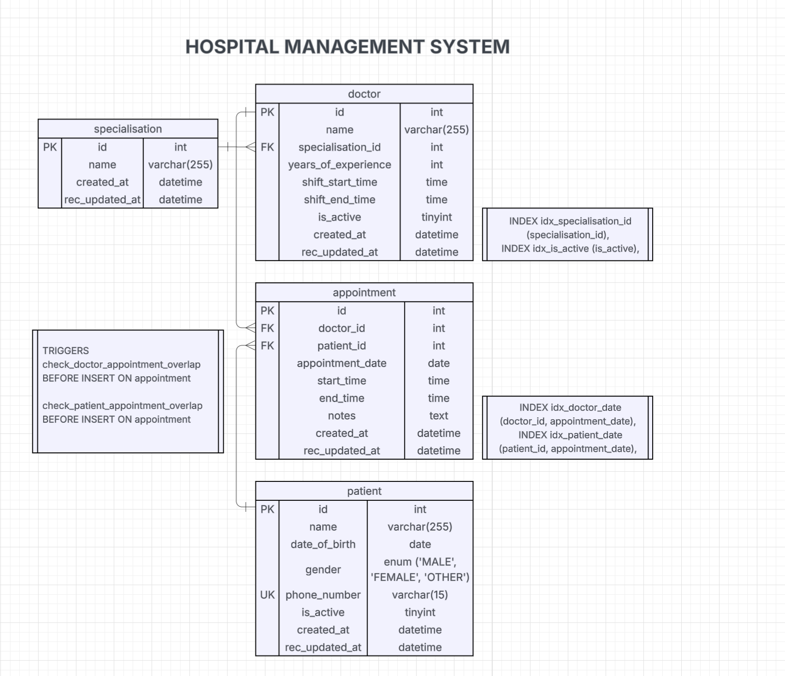
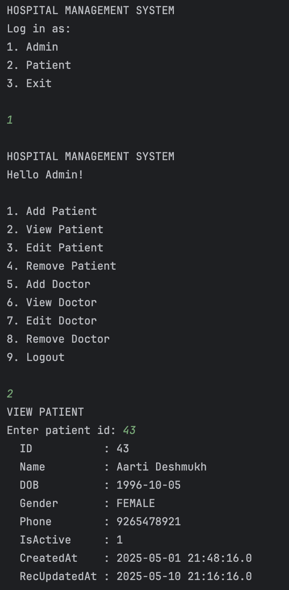
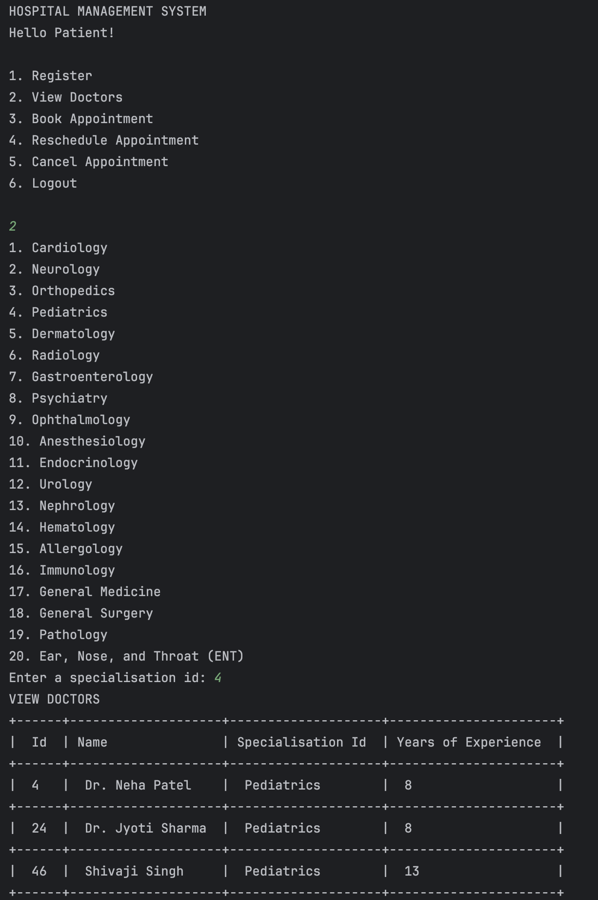
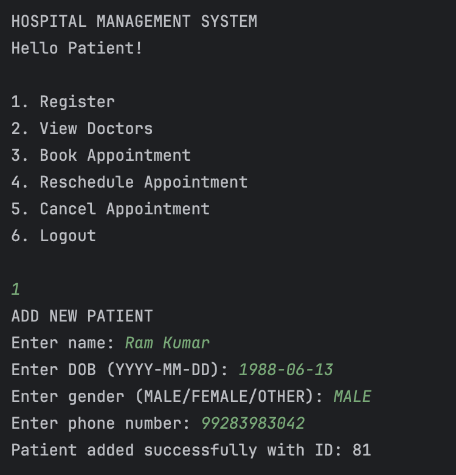
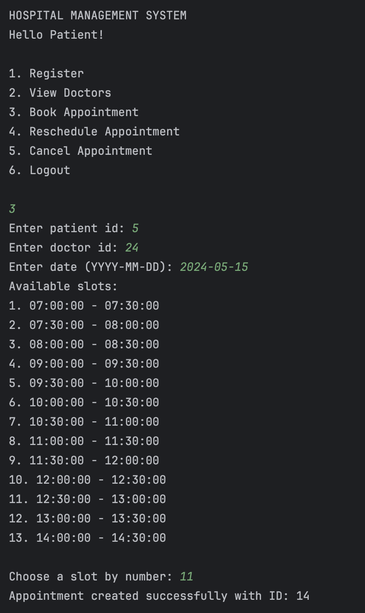

# Hospital Management System

## 📌 About
A console run fully functional application, developed solely with the motivation of improving my proficiency in Java.
 Have used good coding practices and used the DAO design pattern to make a clean and maintainable codebase.

## 📚 Tech Stack

- Java
- MySQL

## ✨ Key Features

Patient view
- Register as a patient
- Search doctors by their specialisation
- View doctor's free slots for appointment within their working hours
- Book an appointment with the doctor of your choice

Admin view
- Add, view, edit or delete doctor information to the database
- Add, view, edit or delete patient information to the database

## 📝 ER Diagram



## 👁 Previews

<table>
  <tr>
    <td></td>
    <td></td>
  </tr>
  <tr>
    <td></td>
    <td></td>
  </tr>
</table>

## ➕ Possible additions

- Add password protection to user/admin roles
- Add GUI using Java Swing or JavaFX


## ⚙️ Setup Instructions

#### 1. 💾 Clone the Repository

```bash
git clone https://github.com/ninadsutrave/HospitalManagement.git
cd HospitalManagement
```

---

### 2. 🧩 Add External Libraries in IntelliJ

#### 👉 MySQL Connector/J
- Download the `.jar` file from:
  https://dev.mysql.com/downloads/connector/j
- In IntelliJ:
  - Go to `File > Project Structure > Libraries`
  - Click the `+` icon > Java
  - Select the MySQL Connector `.jar`

#### 👉 Lombok
- Download `lombok.jar` from:
  https://projectlombok.org/download
- In IntelliJ:
  - Go to `File > Project Structure > Libraries`
  - Click the `+` icon > Java
  - Select the Lombok `.jar`
- Then:
  - Go to `File > Settings > Build, Execution, Deployment > Compiler > Annotation Processors`
  - ✅ Enable "Annotation Processing"

---

### 3. 🧱 Set Up MySQL Database

1. Log in to your MySQL client:

```bash
mysql -u ${user} -p
```

2. Run SQL scripts in this order:

```sql
source sql/create_database.sql;
source sql/create_tables.sql;
source sql/create_triggers.sql;
source sql/insert_seed_data.sql;
```

With these in place you're ready to run the application!

---
